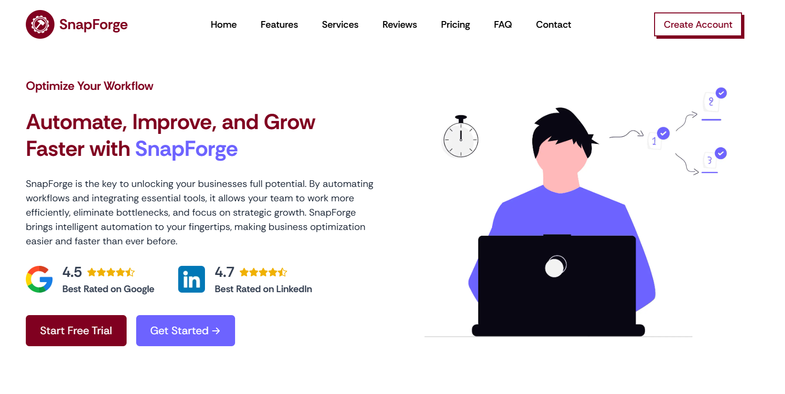

# SnapForge - Automate Social Media Workflows

**SnapForge** is an automation platform built to simplify social media management for businesses and creators. With AI-powered tools and customizable templates, SnapForge streamlines repetitive tasks, allowing users to focus on growing their brand.

You can check out the live version of SnapForge here: [snapforge.vercel.app](https://snapforge.vercel.app)

---

## 🚀 **Features**

- **AI-generated Captions & Hashtags**: Automate content creation with intelligent suggestions.
- **Customizable Templates**: Create tailored social media posts with pre-designed templates.
- **Content Scheduling**: Plan and schedule posts in advance with intuitive calendar integration.
- **Brand Customization**: Personalize every post with your brand colors, logos, and style.

---

## ⚙️ **Tech Stack**

- **Frontend**:  
  - **Next.js (v15)** – A React framework that enables server-side rendering (SSR) and static site generation (SSG) for blazing-fast performance.
  - **React 19** – The latest version of React for building dynamic and reusable components.
  - **Tailwind CSS** – Utility-first CSS framework that allows for responsive and flexible design with minimal effort.
  - **TypeScript** – Ensuring type safety and better development experience with static type checking.
  - 
---

## 📈 **Future Plans**

- Integration with additional social media platforms.
- User authentication and role-based access.
- Advanced analytics dashboard for tracking social media performance.
  
- **Adding Backend**
   
- **Node.js** – JavaScript runtime for scalable server-side logic.
- **Express.js** – Web framework for handling API routes and middleware.
- **MongoDB** – NoSQL database for scalable data storage, perfect for handling social media post data.
  
---

*Home Page*

# **SnapForge** - Empowering businesses to automate and scale effortlessly.
